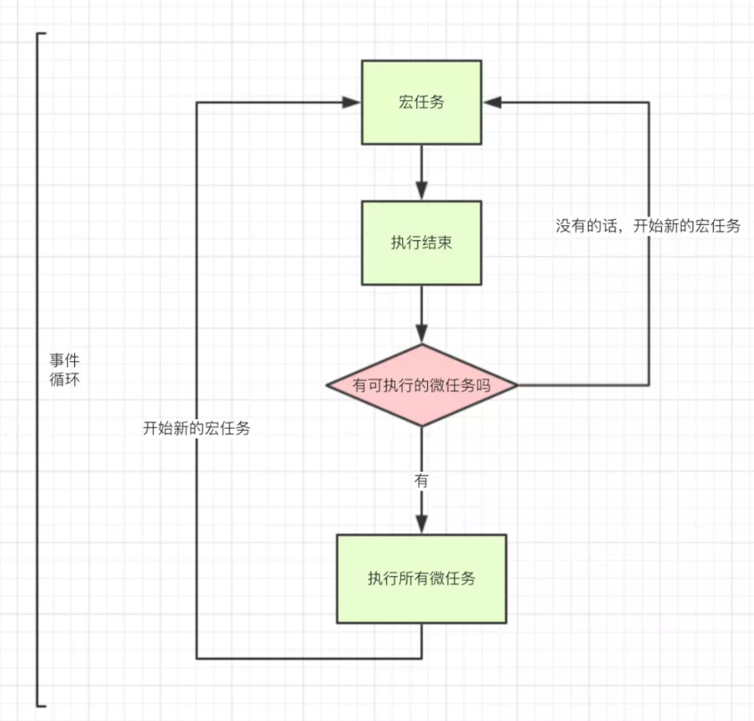

[文章链接](https://juejin.im/post/59e85eebf265da430d571f89#comment)

JS是一门单线程语言，所以处理任务的顺序是一个接一个的执行，但在某些情况下这种执行机制严重影响用户的正常体验，所以聪明的程序员将任务分为两类`同步任务和异步任务`

- 同步和异步任务分别进入不同的执行"场所"，同步的进入主线程，异步的进入Event Table并注册函数。
- 当指定的事情完成时，Event Table会将这个函数移入Event Queue。
- 主线程内的任务执行完毕为空，会去Event Queue读取对应的函数，进入主线程执行。
- 上述过程会不断重复，也就是常说的Event Loop(事件循环)。

除了广义的同步任务和异步任务，我们对任务有更精细的定义：

- macro-task(宏任务)：包括整体代码script，setTimeout，setInterval
- micro-task(微任务)：Promise，process.nextTick

不同类型的任务会进入对应的Event Queue，比如`setTimeout`和`setInterval`会进入相同的Event Queue。

事件循环的顺序，决定js代码的执行顺序。进入整体代码(宏任务)后，开始第一次循环。接着执行所有的微任务。然后再次从宏任务开始，找到其中一个任务队列执行完毕，再执行所有的微任务。

切记切记，一次宏任务执行后就会执行Event Queue 里的微任务 ，触发渲染，渲染完毕后再去执行宏任务，微任务，渲染...以此类推